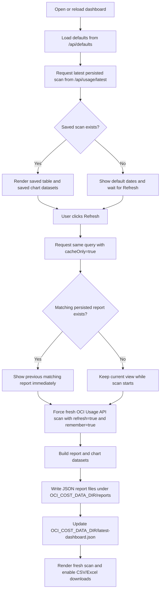

# OCI Cost Analysis Dashboard

Node.js and Express dashboard for scanning Oracle Cloud Infrastructure Cost Analysis data through the OCI Usage API, summarizing tenancy cost and usage, and exporting filtered results to CSV or Excel.

The app uses the local OCI CLI `DEFAULT` profile by default, reads cost data from the tenancy home region, and renders an interactive browser dashboard for grouped usage, service/SKU spend, region activity, compartment cost, daily trends, and billing-period summaries.

## Latest Improvements

- Added clickable legend behavior and visible-total updates for applicable charts, including grouped usage, service/region matrix, compartment cost, unit economics, cost composition, daily cost, region drift, and long-tail SKU spend.
- Replaced the congested long-tail word cloud with a ranked Long-Tail SKU Spend Ladder that handles high-SKU billing periods more cleanly.
- Added full SKU-description tooltips for Service Cards With Nested Top SKUs, including grouped rows with multiple descriptions.
- Disabled annoying inside zoom behavior on Grouped Usage and Compartment Cost by Depth while keeping useful zoom controls on charts that need them.
- Prevented initial page load from auto-scanning; the dashboard now populates dates and waits for the user to click Refresh.
- Added file-backed report persistence so the last dashboard scan can reload on page open, and previous matching scans can render immediately while a fresh OCI scan runs.

## Quick Start

```bash
git clone https://github.com/nafey1/OCI-Cost-Analysis.git
cd OCI-Cost-Analysis
cp .env.example .env
npm install
npm start
```

Open `http://localhost:3000`.

The default local auth path uses `~/.oci/config` with the `DEFAULT` profile. Edit `.env` if you need a different auth method, Usage API region, port, date defaults, or grouping defaults.

## Features

- Authenticates to OCI with config-file auth, instance principals, or resource principals.
- Uses the OCI Usage API to request summarized usage and cost data for a tenancy.
- Defaults the analysis window to the last complete calendar month.
- Uses inclusive start dates and exclusive end dates to avoid partial-month ambiguity.
- Supports Group By values for service, SKU, unit, compartment, platform, region, resource, tenant, and tags.
- Always includes region as the first grouped dimension in the dashboard table.
- Grouped Usage table includes multi-select searchable filters for every column.
- Table filters include All and None actions, typed filtering, region-colored rows, resizable columns, and filtered grand totals.
- Grouped Usage only displays non-zero cost groups.
- Billing Period Summary shows analysis days, unique SKUs, active regions, daily average, peak daily cost, total cost, total usage, and row count.
- Facts for Nerds shows OCI API call count, rows retrieved, approximate JSON payload sent/retrieved, OCI latency, server time, and delivery source.
- Cost Analytics includes region heat grid, top cost drivers waterfall, service/region matrix, compartment cost by depth, unit economics, SKU Pareto, cost composition, long-tail SKU spend, service/SKU cards, region drift, and daily cost explorer.
- Charts include tooltips and PNG download buttons.
- Applicable ECharts legends are clickable and update the chart panel total.
- CSV downloads use the current query criteria.
- Excel downloads can export the currently filtered dashboard table.
- Theme selector includes Light, Dark, Forest, Ocean, and other dashboard themes.
- Compact footer shows source, profile, analysis window, and last scan timestamp.
- Persists previous scan JSON to disk so long-running refreshes can show the last matching result first.
- Docker-ready deployment model keeps OCI config and private keys outside the image.

## Architecture

The application is intentionally simple:

- `src/server.js` runs the Express server, static dashboard, API routes, CSV export, and Excel export.
- `src/ociAuth.js` creates the OCI authentication provider.
- `src/usageClient.js` calls `requestSummarizedUsages` and follows OCI pagination.
- `src/usageReport.js` normalizes OCI Usage API rows into dashboard/API summaries.
- `src/reportStore.js` persists completed report JSON files for fast reloads before fresh scans.
- `src/config.js` centralizes environment config, defaults, grouping options, and query validation.
- `public/` contains the browser UI, ECharts rendering, styles, and OCI logo.

The app uses a short in-memory TTL cache and an optional file-backed report store. There is no database. Completed reports are generated from OCI Usage API responses and can be saved under `OCI_COST_DATA_DIR` so the dashboard can display a previous matching scan immediately before starting a fresh OCI scan.

## Requirements

- Node.js 20 or newer.
- npm.
- OCI SDK credentials through one of:
  - `~/.oci/config` and an OCI profile.
  - Instance principal.
  - Resource principal.
- OCI IAM policy that allows the running principal to read usage reports.
- The Usage API region should be the tenancy home region.

Check whether Node.js and npm are already installed:

```bash
node --version
npm --version
```

For Ubuntu or Debian servers, install a current Node.js LTS release with NodeSource:

```bash
sudo apt-get update
sudo apt-get install -y ca-certificates curl
curl -fsSL https://deb.nodesource.com/setup_22.x | sudo -E bash -
sudo apt-get install -y nodejs
node --version
npm --version
```

For macOS with Homebrew:

```bash
brew install node
node --version
npm --version
```

For Red Hat Enterprise Linux, Oracle Linux, Rocky Linux, AlmaLinux, or Fedora, first check whether your approved OS repositories provide Node.js 20 or newer:

```bash
sudo dnf module list nodejs
sudo dnf module reset -y nodejs
sudo dnf module enable -y nodejs:20
sudo dnf install -y nodejs npm
node --version
npm --version
```

If the OS repositories do not provide Node.js 20 or newer, use the NodeSource RPM repository:

```bash
sudo dnf install -y ca-certificates curl
curl -fsSL https://rpm.nodesource.com/setup_22.x | sudo bash -
sudo dnf install -y nodejs
node --version
npm --version
```

On older Oracle Linux or RHEL systems where `dnf` is not available, use `yum` with the same NodeSource setup script:

```bash
sudo yum install -y ca-certificates curl
curl -fsSL https://rpm.nodesource.com/setup_22.x | sudo bash -
sudo yum install -y nodejs
node --version
npm --version
```

If your OS repository installs a version older than 20, use `nvm`:

```bash
nvm install --lts
nvm use --lts
```

## OCI Policy

The principal running this app needs tenancy-level permission to read usage reports. A narrow starting point for a user group is:

```text
Allow group <group-name> to read usage-reports in tenancy
```

For dynamic groups, use the equivalent dynamic-group policy:

```text
Allow dynamic-group <dynamic-group-name> to read usage-reports in tenancy
```

Do not skip this. OCI authentication can succeed while usage queries still fail or return empty results if IAM policy is wrong.

## OCI Start

### 1. Configure OCI CLI Credentials

For local development, create or verify your OCI CLI config:

```bash
oci setup config
```

The app defaults to:

```text
OCI_AUTH_METHOD=config
OCI_CONFIG_FILE=~/.oci/config
OCI_PROFILE=DEFAULT
```

The selected OCI profile should include:

```ini
[DEFAULT]
user=ocid1.user.oc1...
fingerprint=...
tenancy=ocid1.tenancy.oc1...
region=us-ashburn-1
key_file=/Users/<you>/.oci/oci_api_key.pem
```

With config-file authentication, the tenancy OCID is inferred from the profile. `OCI_TENANCY_OCID` is optional unless you want to override it.

### 2. Pick The Usage API Region

Set `OCI_USAGE_REGION` to the tenancy home region by default. OCI Cost Analysis only allows usage queries from the tenancy home region, so picking an arbitrary subscribed region is the wrong default even when the report contains usage from many regions.

Example:

```text
OCI_USAGE_REGION=us-ashburn-1
```

This region is used for the Usage API client endpoint. It does not filter the report to that region.

### 3. Confirm Date Semantics

The dashboard and API use:

- `start`: inclusive.
- `end`: exclusive.

For a full month, use the first day of the month as `start` and the first day of the next month as `end`.

Example for February 2025:

```text
start=2025-02-01
end=2025-03-01
```

If the dashboard Start date is changed to a date later than End, the End date is cleared to prevent an invalid query.

## Local Run

```bash
cd OCI-Cost-Analysis
cp .env.example .env
npm install
npm start
```

Open `http://localhost:3000`.

Local runs listen on `PORT`, which defaults to `3000`. The current server binds to `0.0.0.0`, so keep it behind a trusted network boundary unless you add authentication in front of it.

For local config-file auth, the app uses `~/.oci/config` and the `DEFAULT` OCI profile unless you override `OCI_CONFIG_FILE` or `OCI_PROFILE`. With config-file auth, the tenancy OCID is inferred from the selected OCI profile, so `OCI_TENANCY_OCID` is optional.

## Configuration

Copy `.env.example` to `.env` and adjust the values you need.

| Variable | Default | Purpose |
| --- | --- | --- |
| `PORT` | `3000` | HTTP port used by the Express server. |
| `OCI_AUTH_METHOD` | `config` | `config`, `instance_principal`, or `resource_principal`. |
| `OCI_CONFIG_FILE` | `~/.oci/config` | OCI config file path for config-file auth. |
| `OCI_PROFILE` | `DEFAULT` | OCI config profile. |
| `OCI_TENANCY_OCID` | empty | Optional for config auth when tenancy can be inferred; required when the provider cannot expose tenancy OCID. |
| `OCI_USAGE_REGION` | `us-ashburn-1` | Region used for the OCI Usage API client. Use the tenancy home region. |
| `DEFAULT_START_DATE` | last whole month start | Optional dashboard/API default start date, inclusive. |
| `DEFAULT_END_DATE` | current month start | Optional dashboard/API default end date, exclusive. |
| `DEFAULT_GRANULARITY` | `DAILY` | `DAILY` or `MONTHLY`. |
| `DEFAULT_QUERY_TYPE` | `COST` | `COST`, `USAGE`, or `USAGE_ONLY`. |
| `DEFAULT_GROUP_BY` | `service` | Comma-separated default grouping fields. |
| `CACHE_TTL_SECONDS` | `300` | In-memory report cache TTL. Use `0` to disable. |
| `PERSIST_REPORTS` | `true` | Enables file-backed report persistence for completed scans. |
| `OCI_COST_DATA_DIR` | `./data` locally, `/app/data` in Docker | Directory where persisted report JSON is stored. Mount this path for container persistence. |
| `PERSIST_MAX_REPORTS` | `250` | Maximum persisted report files to keep before pruning oldest files. |

## Dashboard Workflow

1. Confirm `.env` points to the right OCI auth method, profile, tenancy, and Usage API region.
2. Open the dashboard.
3. Review the populated default Start and End dates. The app does not auto-scan on initial load, but it restores the latest persisted dashboard scan if one exists.
4. Choose granularity, query type, Group By, and compartment depth.
5. Click Refresh. If a persisted report exists for the same normalized query, it renders first while a fresh OCI scan runs in the background.
6. Review Billing Period Summary and Cost Analytics.
7. Review Facts for Nerds when you need API call, payload, latency, cache, or persistence diagnostics.
8. Use Grouped Usage table filters to narrow the visible rows.
9. Check the Grand Total row after filtering; it reflects the current table filters.
10. Use clickable chart legends where present to hide or show series and update visible chart totals.
11. Download CSV for query-level grouped data or Excel for the currently filtered dashboard table.

### Persistence Flow



## Date Window Rules

- `start` is inclusive.
- `end` is exclusive.
- Defaults are populated from the last complete calendar month.
- A full March 2026 window is `2026-03-01` through `2026-04-01`.
- A full February 2025 window is `2025-02-01` through `2025-03-01`.
- If Start becomes greater than End in the UI, End is blanked out.

## Group By Fields

Supported Group By values:

- `service`
- `skuName`
- `skuPartNumber`
- `unit`
- `compartmentName`
- `compartmentPath`
- `compartmentId`
- `platform`
- `region`
- `logicalAd`
- `resourceId`
- `tenantId`
- `tenantName`
- `tagNamespace`
- `tagKey`
- `tagValue`

The dashboard automatically includes `region` first, even when the user selects a different primary Group By value.

## API

### `GET /api/defaults`

Returns effective dashboard defaults, selected OCI profile, auth method, Usage API region, Group By options, and tenancy discovery status.

### `GET /api/usage`

Scans or returns cached summarized usage data.

Query parameters:

- `start`: inclusive start date, `YYYY-MM-DD`
- `end`: exclusive end date, `YYYY-MM-DD`
- `granularity`: `DAILY` or `MONTHLY`
- `queryType`: `COST`, `USAGE`, or `USAGE_ONLY`
- `groupBy`: comma-separated group fields, for example `service,skuName`
- `compartmentDepth`: optional integer from `0` through `5`
- `tenantId`: optional tenancy OCID override
- `includeRows`: set to `true` to include raw OCI rows in the JSON response
- `cacheOnly`: set to `true` to return only an in-memory or persisted report without calling OCI
- `refresh`: set to `true` to bypass cached/persisted reports and force a fresh OCI Usage API scan
- `remember`: set to `true` to mark the completed fresh scan as the latest dashboard scan

Example:

```bash
curl "http://localhost:3000/api/usage?start=2025-02-01&end=2025-03-01&granularity=DAILY&queryType=COST&groupBy=service,skuName"
```

Fast-load an existing persisted scan without calling OCI:

```bash
curl "http://localhost:3000/api/usage?start=2025-02-01&end=2025-03-01&granularity=DAILY&queryType=COST&groupBy=service,skuName&cacheOnly=true"
```

Force a fresh scan and persist the result:

```bash
curl "http://localhost:3000/api/usage?start=2025-02-01&end=2025-03-01&granularity=DAILY&queryType=COST&groupBy=service,skuName&refresh=true&remember=true"
```

### `GET /api/usage/latest`

Returns the latest persisted dashboard scan without calling OCI. The browser uses this on page load to restore the previous table and any saved chart datasets.

```bash
curl "http://localhost:3000/api/usage/latest"
```

### `GET /api/usage.csv`

Returns grouped usage as CSV for the same query parameters supported by `/api/usage`.

### `GET /api/usage.xlsx`

Returns grouped usage as an Excel workbook for the same query parameters supported by `/api/usage`.

### `POST /api/usage.xlsx`

Used by the browser dashboard to export the currently filtered visible table to Excel.

### `GET /healthz`

Health check endpoint:

```json
{"ok":true}
```

## Docker Run

Build the image:

```bash
docker build -t oci-cost-analysis .
```

Run with local OCI config mounted from the host:

```bash
docker run --rm -p 3000:3000 \
  --name oci-cost-analysis \
  --env-file .env \
  -e OCI_AUTH_METHOD=config \
  -e OCI_CONFIG_FILE=/home/node/.oci/config \
  -e OCI_PROFILE=DEFAULT \
  -e PERSIST_REPORTS=true \
  -e OCI_COST_DATA_DIR=/app/data \
  -v "$HOME/.oci:/home/node/.oci:ro" \
  -v "$PWD/data:/app/data" \
  oci-cost-analysis
```

Open `http://localhost:3000`.

For OCI-hosted deployment, use `OCI_AUTH_METHOD=instance_principal` or `OCI_AUTH_METHOD=resource_principal` and avoid mounting an API key.

### Host Filesystem Mount For Persistence

The app can persist completed scan reports as JSON files. This is what enables fast reloads: when the same normalized query is requested again, the dashboard can show the previous matching result immediately and then run a fresh OCI scan.

Two host paths matter:

- OCI credentials: mount read-only to `/home/node/.oci`.
- Persisted reports: mount read-write to `/app/data`.

Persisted report files contain cost and usage data. Treat this directory as sensitive financial data. Do not bake it into the image and do not commit it to Git.

Example host directory:

```bash
mkdir -p "$HOME/.oci"
mkdir -p "$PWD/data"
```

Example container run:

```bash
docker run --rm -p 3000:3000 \
  --name oci-cost-analysis \
  --env-file .env \
  -e OCI_AUTH_METHOD=config \
  -e OCI_CONFIG_FILE=/home/node/.oci/config \
  -e OCI_PROFILE=DEFAULT \
  -e PERSIST_REPORTS=true \
  -e OCI_COST_DATA_DIR=/app/data \
  -v "$HOME/.oci:/home/node/.oci:ro" \
  -v "$PWD/data:/app/data" \
  oci-cost-analysis
```

If you keep `.env` outside the image as a host-managed file, pass it with `--env-file .env`. Do not copy OCI private keys, persisted report data, or cost report exports into the Docker image.

### Docker Compose Example

```yaml
services:
  oci-cost-analysis:
    build: .
    image: oci-cost-analysis:latest
    ports:
      - "3000:3000"
    env_file:
      - .env
    environment:
      OCI_AUTH_METHOD: config
      OCI_CONFIG_FILE: /home/node/.oci/config
      OCI_PROFILE: DEFAULT
      PERSIST_REPORTS: "true"
      OCI_COST_DATA_DIR: /app/data
    volumes:
      - ${HOME}/.oci:/home/node/.oci:ro
      - ./data:/app/data
    restart: unless-stopped
```

### Kubernetes Persistent Volume Pattern

For Kubernetes or OpenShift-style deployments, mount a `PersistentVolumeClaim` at `/app/data` and set `OCI_COST_DATA_DIR=/app/data`. Keep OCI credentials separate from persisted reports; use instance/resource principals where possible, or mount config-file credentials from a Secret.

Minimal PVC example:

```yaml
apiVersion: v1
kind: PersistentVolumeClaim
metadata:
  name: oci-cost-analysis-data
spec:
  accessModes:
    - ReadWriteOnce
  resources:
    requests:
      storage: 10Gi
```

Deployment volume mount excerpt:

```yaml
env:
  - name: PERSIST_REPORTS
    value: "true"
  - name: OCI_COST_DATA_DIR
    value: /app/data
volumeMounts:
  - name: report-data
    mountPath: /app/data
volumes:
  - name: report-data
    persistentVolumeClaim:
      claimName: oci-cost-analysis-data
```

If your cluster requires an explicit `PersistentVolume`, bind the PVC to storage that supports `ReadWriteOnce`. Do not use ephemeral `emptyDir` if previous scan reloads must survive pod restarts.

## Development

```bash
node --check public/app.js
npm test
```

## Operational Notes

- Use the tenancy home region for `OCI_USAGE_REGION`; Cost Analysis usage queries are not served from arbitrary subscribed regions.
- A wide billing window combined with high-cardinality Group By fields can return many rows and take longer to render.
- Grouping by resource, tag, or SKU description can expose sensitive financial or tenancy metadata.
- CSV and Excel exports should be treated as sensitive financial data.
- The dashboard hides zero-cost grouped rows by design.
- The Compartment Depth selector is limited to level 5 to keep hierarchy reporting readable.
- The app uses a short in-memory cache keyed by normalized query parameters; set `CACHE_TTL_SECONDS=0` to disable memory-only reuse.
- With `PERSIST_REPORTS=true`, every completed scan is written to `OCI_COST_DATA_DIR` and reused as a fast previous result before a fresh scan.
- Set `PERSIST_REPORTS=false` if the deployment is not allowed to store cost data on disk.
- Facts for Nerds payload sizes are approximate JSON payload sizes measured around OCI SDK calls, not exact TCP wire bytes.
- Keep `.env`, OCI private keys, persisted report data, and exported cost reports out of Git.
- Keep persisted report data out of backups that are not approved for financial data.
- Prefer instance principal or resource principal for OCI-hosted deployments.
- Expose the dashboard only on trusted networks unless you add authentication and authorization in front of it.

## Troubleshooting

### `OCI_TENANCY_OCID or tenantId query parameter is required`

The app could not infer the tenancy OCID. Verify the selected OCI profile has a `tenancy` value or set:

```text
OCI_TENANCY_OCID=ocid1.tenancy.oc1...
```

### Usage Query Returns Authorization Errors

Authentication succeeded, but IAM policy is missing or too narrow. Add usage-report read access for the user group or dynamic group.

### No Chart Data For A Date Window

The dashboard intentionally hides zero-cost grouped rows. If OCI returns only zero-cost rows for the selected window, charts will be empty and the status message will call that out.

### Docker Cannot Find The OCI Key

Check that `key_file` inside the mounted config points to a path that exists inside the container. The safest pattern is to keep the key under `$HOME/.oci` and mount that directory to `/home/node/.oci`.

### Previous Scans Do Not Reload

Verify `PERSIST_REPORTS=true`, `OCI_COST_DATA_DIR` points to a writable directory, and the scan completed after this persistence feature was enabled. In Docker, mount a host directory or persistent volume to `/app/data`; without that mount, persisted reports are lost when the container is removed. Older persisted query files without the latest-dashboard pointer can still be reused after Refresh, but page-load restore needs a completed remembered dashboard scan.

## Repository Update History

- Added file-backed report persistence, page-load last-scan restore, fast previous-scan loading, Docker data-volume guidance, and Kubernetes PVC examples.
- Added Facts for Nerds scan diagnostics for OCI calls, payload size, latency, cache/persistence source, and server timing.
- Added repository `AGENTS.md` instructions for future development agents.
- Reworked README into an operational dashboard guide with Quick Start, Features, Architecture, Requirements, OCI Policy, Local Run, Configuration, Workflow, API, Docker, Development, Operational Notes, and Troubleshooting.
- Added clickable chart legend behavior with visible-total updates where the chart semantics support it.
- Replaced the long-tail word cloud with a ranked SKU spend ladder for high-SKU readability.
- Added full multi-description hover tooltips to Service Cards With Nested Top SKUs.
- Removed inside zoom behavior from Grouped Usage and Compartment Cost by Depth.
- Added CSV and Excel export paths, including Excel export for the currently filtered dashboard table.
- Added summary panels for billing period, unique SKUs, active regions, daily average, and peak daily cost.
- Added theme selection, OCI branding, chart download buttons, and chart/table tooltips.
- Limited compartment depth filtering to level 5 and clarified inclusive/exclusive analysis dates.
